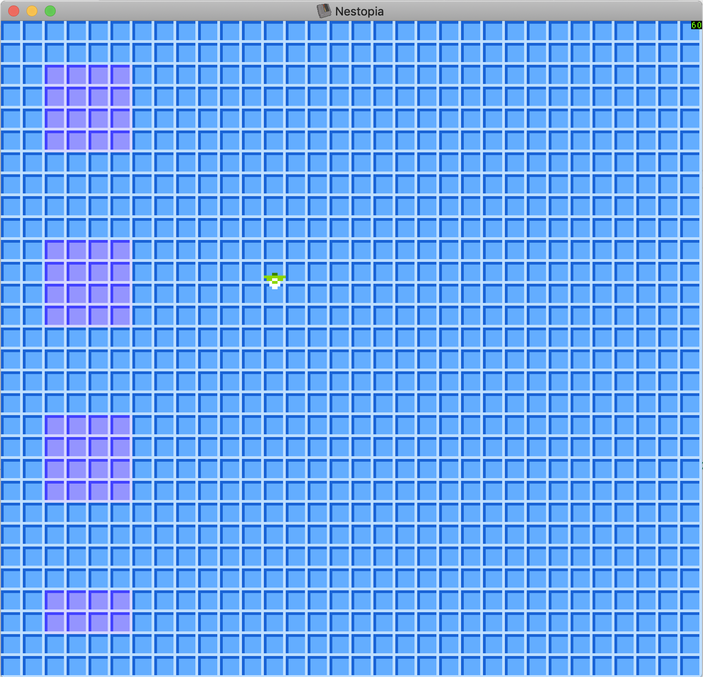

# Belinda the Bluejay



A game written in 6502 assembly code for the Nintendo Entertainment System (NES). I'm at the start of this project and it currently initialises the NES (correctly, for my own purposes at least), sets up a controllable sprite and an NPC sprite that moves around on its own (following a predefined way point in an infinite loop). The render loop handles controller input for all 8 directions (on a compass) and has code to select and configure an appropriate directional sprite. I've started learning 6502 assembly from scratch, so this is the definition of a "My First Assembly Language Program". I'm counting on making big mistakes because if I gain the wisdom to recognise them, I'll learn loads more.

## Assembling

You need to get the `ca65` assembler and make sure the executable is resolvable by your shell from your search path.  

```bash
 > % ./configure
checking for a BSD-compatible install... /usr/local/bin/ginstall -c
checking whether build environment is sane... yes
checking for a thread-safe mkdir -p... /usr/local/bin/gmkdir -p
checking for gawk... no
checking for mawk... no
checking for nawk... no
checking for awk... awk
checking whether make sets $(MAKE)... yes
checking whether make supports nested variables... yes
checking for ca65... true
 > % ./build.sh
```

This `configure` script will fail if `ca65` isn't on you binary path.

## Autoconf

GNU Autotools are used to generate the `configure` script. Modifications should be made to `configure.ac` and regenerated as shown.

```bash
> $ aclocal
> $ autoconf
```

## Running

You can just open the `rom.nes` file in a NES emulator, safest bet would be Nestopia (other ones might work, I've not tried). I wouldn't ordinarily add compiled binaries to a Git repo, but they're only 40KB and saves a lot of hassle.

## Tools

The tools folder has one tool for generating a name table in two 480 byte components initialised with `0x24`. The name table is split in two because it allows it be processed by the assembly code with only 8-bit numbers. Check out the source code to see further what I mean.

To use a different blanking char, modify the first parameter passed to the `generateBlankNameTable` function in `tools/main.js`.

N.B. Requires Node.js, version 10 or above is recommended.

```bash
belinda-the-bluejay-6502-nes <master> % node tools/main.js

belinda-the-bluejay-6502-nes <master> % ls -la
-rw-r--r--   1 burtol86  287753940    480  8 Aug 12:52 name-table-0.dat
-rw-r--r--   1 burtol86  287753940    480  8 Aug 12:52 name-table-1.dat


belinda-the-bluejay-6502-nes <master> % hexdump name-table-0.dat
0000000 24 24 24 24 24 24 24 24 24 24 24 24 24 24 24 24
*

belinda-the-bluejay-6502-nes <master> % hexdump name-table-1.dat
0000000 24 24 24 24 24 24 24 24 24 24 24 24 24 24 24 24
*
```

## Resources

|URL|Content|Type|
|---|---|---|
|https://github.com/cc65/cc65/blob/master/cfg/nes.cfg|Ca65 configuration file for the NES, it documents the assembler sections and assumed address space setup specific to this platform.|Reference|
